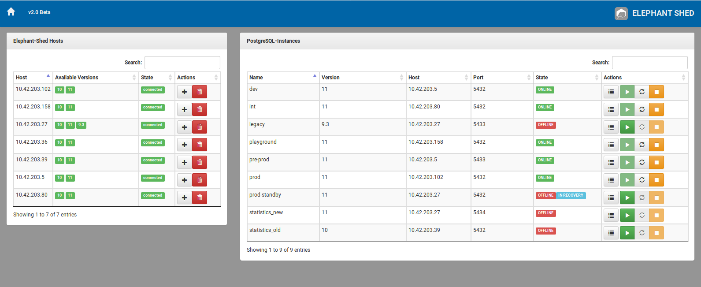
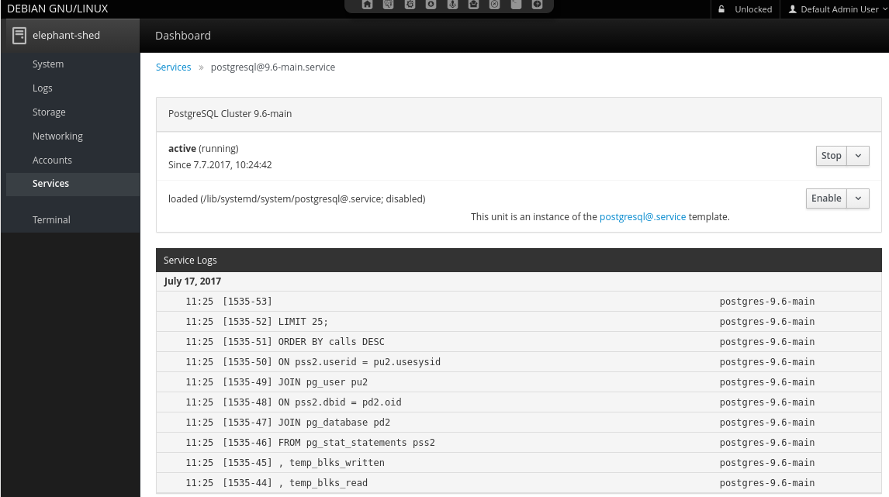
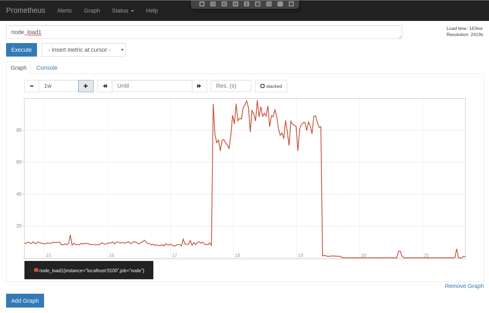
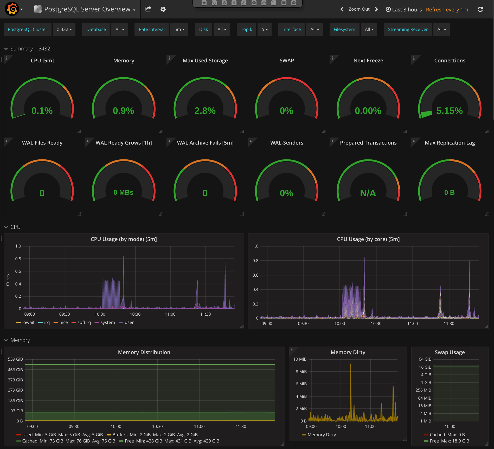
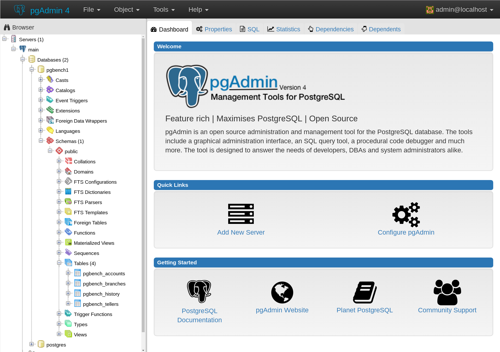
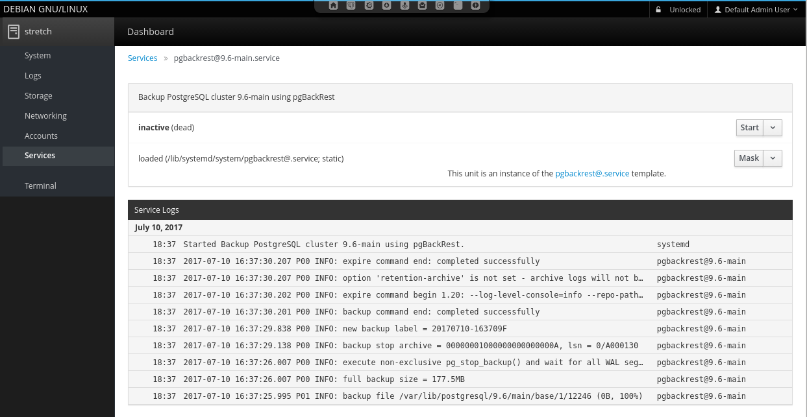
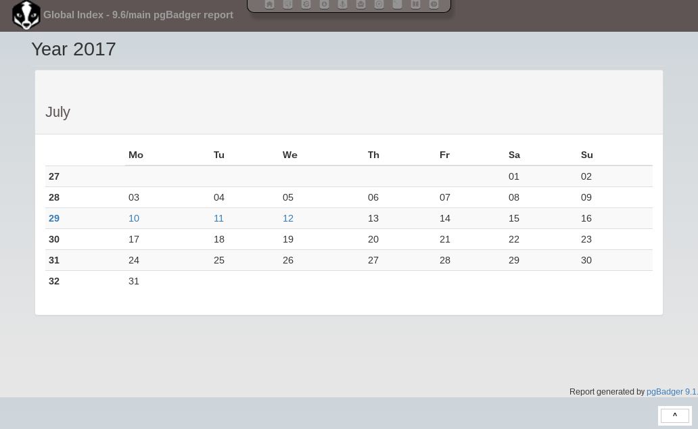
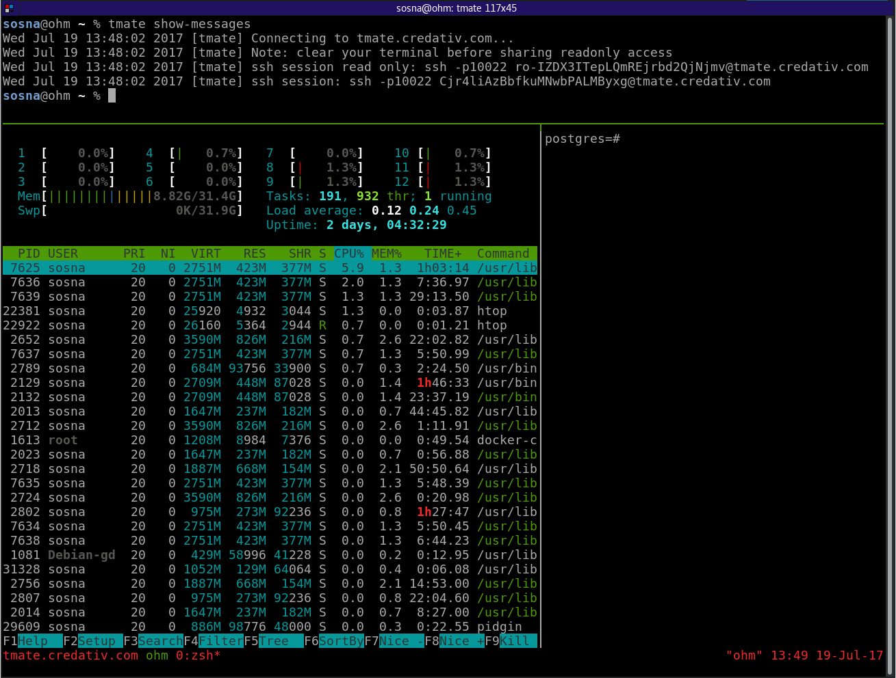

# Intro

Elephant Shed is a web-based PostgreSQL management front-end that bundles
several utilities and applications for use with PostgreSQL. It currently
manages single-node Linux PostgreSQL servers and appliances.

The main components are:

* PostgreSQL - <https://www.postgresql.org/>
* pgAdmin4 - <https://www.pgadmin.org/>
* postgresql-common - <https://salsa.debian.org/postgresql/postgresql-common>
* pgBadger - <http://dalibo.github.io/pgbadger/>
* pgBackRest - <http://www.pgbackrest.org/>
* Grafana - <https://grafana.com/>
* Prometheus - <https://prometheus.io/>
* Cockpit - <http://cockpit-project.org/>
* Shell In A Box - <https://github.com/shellinabox/shellinabox>
* tmate - <https://tmate.io/>

Supported PostgreSQL versions, via <https://apt.postgresql.org>:

* 11
* 10
* 9.6
* 9.5
* 9.4

Supported distributions:

* Debian Stretch (9)
* Ubuntu Bionic (18.04)
* RHEL/CentOS (7)

# Download

Packages, Vagrant boxes, images: <https://elephant-shed.io/#download>

# Documentation

The documentation is located at <https://elephant-shed.io/doc/>

# Screenshots

## Portal

The main portal webpage has links to all bundled applications. It also shows
the PostgreSQL status, and allows starting/stopping the clusters, backup, and
log reports.

## Cockpit

For managing clusters and services, Cockpit is used.

## Monitoring - Prometheus

Prometheus is a metric based monitoring system for servers and services. It
collects metrics from configured targets at given intervals, evaluates rule
expressions, displays the results, and can trigger alerts if some condition is
observed to be true.

## Monitoring - Grafana

Grafana bundles metrics collected by Prometheus and presents them in a dashboard.

## DBA Tool - pgAdmin4

pgAdmin4 is a management tool for PostgreSQL to help DBAs execute many different tasks.
It provides user management, DDL functionality, an interactive SQL shell, and more.

## Backup - pgBackRest

The Elephant Shed comes with a preinstalled backup solution, *pgBackRest*.

## Reporting - pgBadger

A pgBadger report is created for each PostgreSQL instance.

## Web Terminal - Shell In A Box

Shell In A Box is a convenient web based terminal.

## Remote Control - tmate

tmate is a fork of the popular terminal multiplexer tmux, tweaked for instant
terminal sharing. It is preconfigured to connect to a relay server and enables
the user to share the current terminal with a third party using a secret token.

# License

The Elephant Shed itself is licensed under the GPLv3 (<https://www.gnu.org/licenses/gpl-3.0.html>).

All bundled components are Free/Open-Source software with a known and approved open source license.

# Support

* Documentation: <https://elephant-shed.io/doc/>
* Web-Chat: [#elephant-shed](https://webchat.oftc.net/?nick=web-user-.&channels=elephant-shed&uio=MT11bmRlZmluZWQmMj10cnVlJjk9dHJ1ZSYxMT0yMzY31)
* IRC [#elephant-shed](https://webchat.oftc.net/?channels=elephant-shed&uio=MT11bmRlZmluZWQmMj10cnVlJjk9dHJ1ZSYxMT0yMzY31
) on [irc.oftc.net](https://www.oftc.net/)

Elephant Shed is an open source project, developed and maintained by credativ.

For the Elephant Shed PostgreSQL appliance, credativ offers comprehensive
technical support with service level agreements, which are also available
on 365 days a year and 24 hours a day as an option.

Installation and integration support, as well as an introduction
in Elephant Shed PostgreSQL appliance is of course also part of
credativ's services. If you are interested, please feel free to contact us.

* **Web** [credativ.de](https://credativ.de)
* **E-Mail:** [info@credativ.de](mailto:info@credativ.de)
* **Phone:** [+49 2166 9901-0](tel:+49216699010)
